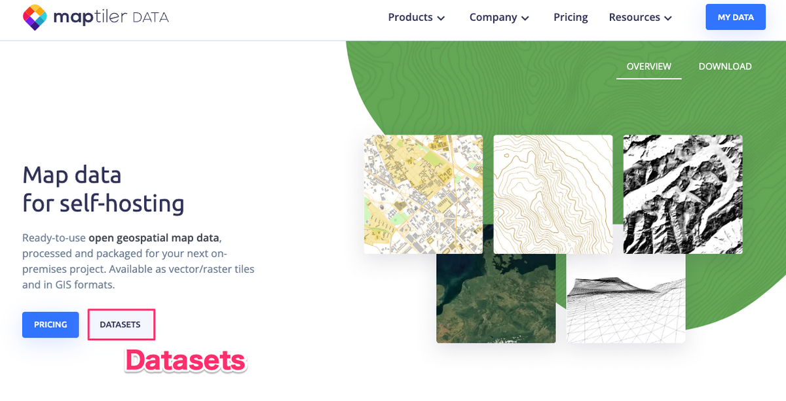
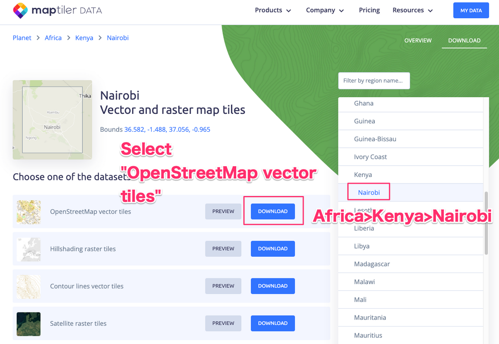
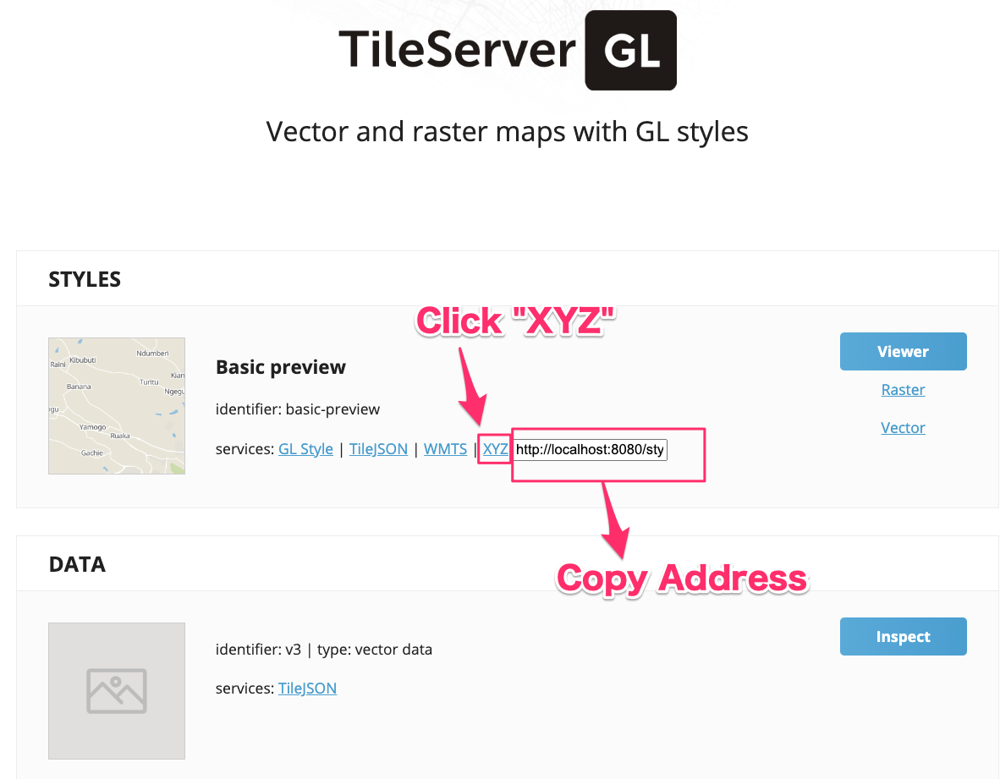
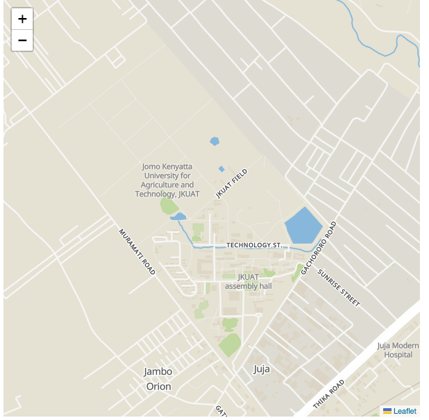

# How to render an offline map using a local tile server

## 1. Set up a tile server
Use `tileserver-gl`: [https://github.com/maptiler/tileserver-gl](https://github.com/maptiler/tileserver-gl)

```
npm install -g tileserver-gl
```

## 2. Download map tile data
#### Visit Maptiler Data. Click Datasets.

#### Select region and download in OpenStreetMap vector tiles format. (.mbtiles format)


## 3. Launch local tile server
```
$ tileserver-gl osm-2020-02-10-v3.11_kenya_nairobi.mbtiles
```
Open localhost:8080. Click XYZ and copy the address shown.



## 4. Render the map using Leaflet
#### Insert the tile server URL in the `tileLayer` function
```
<!DOCTYPE html>
<html>
  <head>
    <meta charset="UTF-8">
    <title>test</title>
    <link rel="stylesheet" href="https://unpkg.com/leaflet@1.9.3/dist/leaflet.css" />
    <script src="https://unpkg.com/leaflet@1.9.3/dist/leaflet.js"></script>
    <script>
      function init() {
              var mymap = L.map('mapcontainer');
              mymap.setView([-1.091176, 37.011073], 15,);
              L.tileLayer("http://localhost:8080/styles/basic-preview/{z}/{x}/{y}.png").addTo(mymap);
            }
    </script>
  </head>
  <body onload="init()">
    <div id="mapcontainer" style="width:600px;height:600px"></div>
  </body>
</html>
```
Rendered result




